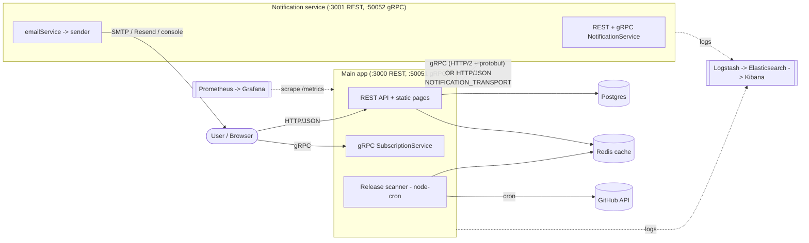
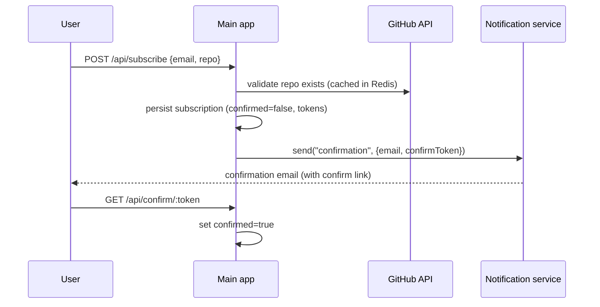
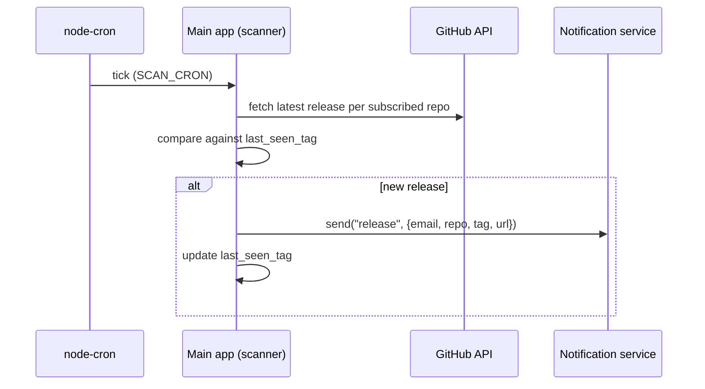
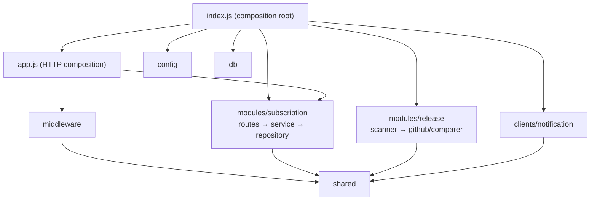

# Architecture

GitHub Release Notifications — a system that lets users subscribe to a GitHub
repository and receive an email when a new release is published.

## System context

Two application services plus backing infrastructure. The main app owns the
subscription domain and the release scanner; the notification service owns
email delivery. They are decoupled by a notification client whose transport
(gRPC or HTTP/REST) is chosen at runtime.



### Services

| Service                           | Responsibility                                                            | Interfaces                                                                        |
| --------------------------------- | ------------------------------------------------------------------------- | --------------------------------------------------------------------------------- |
| **Main app** (`app`)              | Subscription lifecycle, release detection, orchestration of notifications | REST `:3000`, gRPC `SubscriptionService :50051`                                   |
| **Notification** (`notification`) | Render templates and deliver email                                        | REST `POST /api/notifications/send :3001`, gRPC `NotificationService.Send :50052` |

### Infrastructure

- **Postgres** — subscriptions (email, repo, tokens, confirmed, last_seen_tag).
- **Redis** — GitHub API response cache (repo validation, release lookups).
- **Elasticsearch + Logstash + Kibana** — centralized structured logs.
- **Prometheus + Grafana** — metrics scraped from `/metrics`, dashboards.

## Communication

- **Client → main app**: HTTP/JSON (public API + static confirm/unsubscribe
  pages) and gRPC (`SubscriptionService`).
- **Main app → notification service**: one internal synchronous call
  (`send(templateId, email, data)`), pluggable transport:
  - **gRPC** — `NotificationService.Send`, HTTP/2 + protobuf (default).
  - **HTTP/REST** — `POST /api/notifications/send`, HTTP/1.1 + JSON.
  - Selected by `NOTIFICATION_TRANSPORT=grpc|http`; both implementations are
    kept side by side (see `clients/notification/`).
- **gRPC error handling**: domain errors map to canonical status codes
  (`ValidationError → INVALID_ARGUMENT`, `NotFoundError → NOT_FOUND`,
  `ConflictError → ALREADY_EXISTS`, `RateLimitError → UNAVAILABLE`, else
  `INTERNAL`).

## Key flows

### Subscribe → confirm



### Release detection → notify



## Layered architecture (main app)

The main app is organized into layers with a strict dependency direction:
**lower layers never import higher ones.** Domain modules are isolated from
each other and receive their collaborators via dependency injection (factory
functions), so they never reach for infrastructure or transport directly.



| Layer                  | Contents                                            | May depend on          |
| ---------------------- | --------------------------------------------------- | ---------------------- |
| `shared`               | errors, logger, tokenService, cacheService          | (nothing internal)     |
| `config`, `db`         | configuration, Postgres pool + migrations           | (nothing internal)     |
| `clients/notification` | gRPC/HTTP notification transport + selector         | `shared`               |
| `modules/*`            | domain (subscription, release), one module per box  | `shared` + own module  |
| `middleware`           | auth, error handler, metrics                        | `shared`               |
| `app.js`               | wires routes + middleware into an Express app       | modules, middleware, … |
| `index.js`             | composition root — constructs and starts everything | everything             |

Within a module the direction is **repository → service → routes**: a
repository never imports a service or a controller, and a service never imports
a route.

## Architectural fitness tests (bonus)

These rules are enforced automatically, not just documented. A static
dependency test scans every `require()` edge in the main app and fails the
build on any violation:

- `__tests__/unit/architecture/layers.test.js`

It checks that (1) each layer only imports layers it is allowed to, (2) domain
modules do not import each other, (3) `shared` imports nothing internal, and
(4) intra-module direction repository → service → routes is respected. Run with:

```bash
npm run test:unit
```
