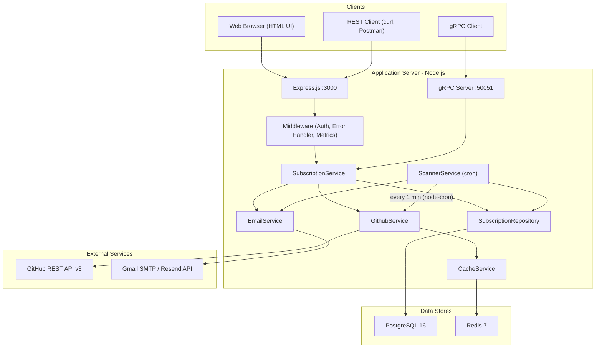
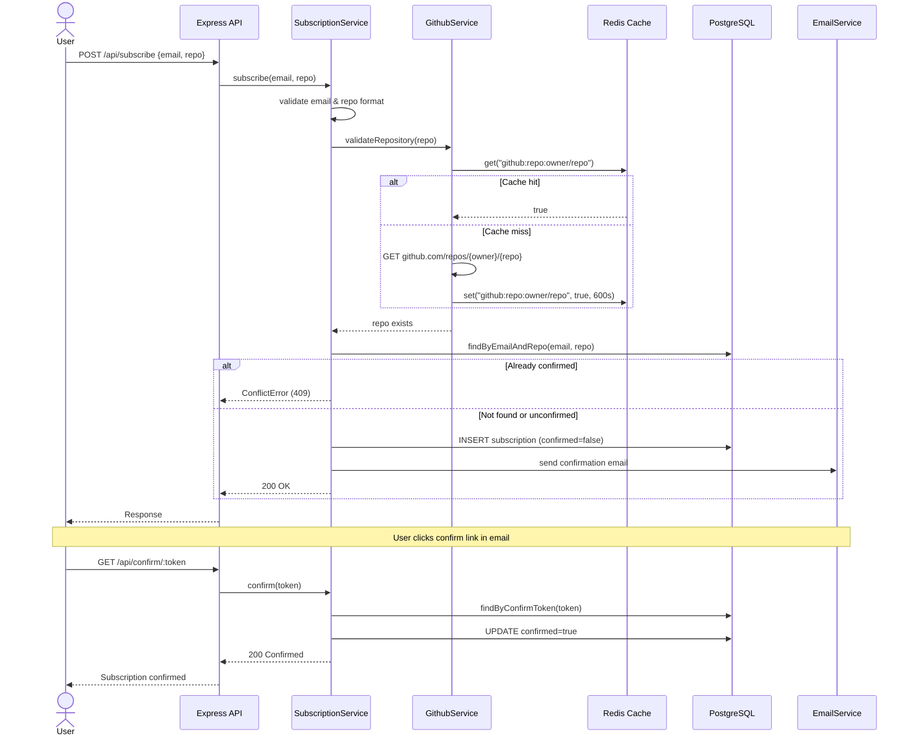
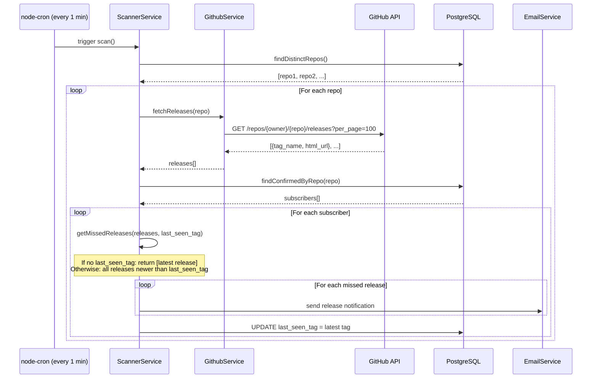
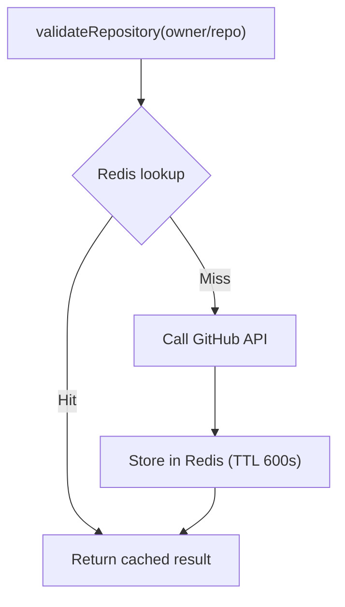
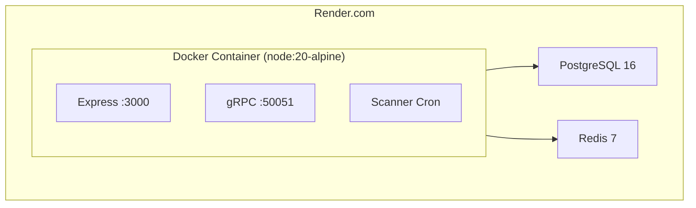

# System Design: GitHub Release Notification API

## 1. Context & Problem Statement

Users who depend on open-source libraries need timely awareness of new releases.
Manually checking GitHub is tedious and error-prone.

**GitHub Release Notification API** solves this by letting users subscribe (via email) to any public GitHub repository and automatically receiving email notifications whenever a new release is published.

**Deployment:** <https://software-engineering-school-testcase-2026.onrender.com/>

---

## 2. System Requirements

### 2.1 Functional Requirements

- **FR-1:** A user can subscribe to releases of any public GitHub repository by providing an email and `owner/repo`.
- **FR-2:** Subscriptions are confirmed via email (double opt-in).
- **FR-3:** A user can unsubscribe through a unique link included in every notification email.
- **FR-4:** The system periodically checks for new releases on a configurable schedule (cron).
- **FR-5:** The system sends an email notification for every new release detected.
- **FR-6:** The API is accessible via both REST and gRPC.
- **FR-7:** A user can view the list of their active subscriptions.

### 2.2 Non-Functional Requirements

- **NFR-1 Availability:** The service should be available 24/7 (Render.com with auto-restart).
- **NFR-2 Latency:** API responses for CRUD operations should be < 500 ms.
- **NFR-3 Scalability:** Support thousands of subscriptions while respecting GitHub API rate limits (caching via Redis).
- **NFR-4 Observability:** Prometheus metrics for monitoring HTTP request latency, throughput, and process health.
- **NFR-5 Security:** Optional API Key authentication; token-based email confirmation and unsubscribe flows.
- **NFR-6 Testability:** Dependency injection architecture allows easy mocking in unit/integration tests.

### 2.3 Constraints

- GitHub REST API v3 rate limit: 60 req/hr (unauthenticated) or 5,000 req/hr (with token).
- Single-process deployment on Render.com free/starter tier.
- No webhook endpoint registration on monitored repos (users subscribe to repos they do not own).
- Email delivery depends on third-party providers (Gmail SMTP or Resend API).

---

## 3. Load Estimation

### 3.1 Users & Traffic

| Parameter | Estimate |
|-----------|----------|
| Total subscribers | ~1,000 |
| Unique repos tracked | ~200 |
| New subscriptions per day | ~20 |
| Confirm/unsubscribe actions per day | ~20 |
| API requests per day (subscribe + list) | ~100 |

### 3.2 Scanner Load

| Parameter | Estimate |
|-----------|----------|
| Scan interval | 1 minute (configurable) |
| GitHub API calls per scan | 1 per unique repo = ~200 |
| Scans per hour | 60 |
| GitHub API calls per hour | ~12,000 (exceeds unauthenticated limit; token required) |
| Emails per day (avg 2 releases/repo/week) | ~60 |

### 3.3 Data Sizes

| Entity | Avg row size | Total rows | Total size |
|--------|-------------|------------|------------|
| Subscription | ~500 B | 1,000 | ~500 KB |
| Redis cache entries | ~200 B per key | 200 | ~40 KB |

### 3.4 Bandwidth

| Traffic type | Per request | Daily volume | Daily bandwidth |
|--------------|------------|--------------|-----------------|
| API request/response | ~1 KB | 100 | ~100 KB |
| GitHub API response (releases) | ~50 KB | 12,000 | ~600 MB |
| Outbound emails | ~5 KB | 60 | ~300 KB |

---

## 4. High-Level Architecture



---

## 5. Detailed Component Design

### 5.1 API Layer

#### REST Endpoints (Express.js, port 3000)

| Method | Endpoint | Description | Auth | Request Body | Success Response |
|--------|----------|-------------|------|--------------|-----------------|
| POST | `/api/subscribe` | Subscribe to a repository | API Key (optional) | `{email, repo}` | `200 {message}` |
| GET | `/api/confirm/:token` | Confirm subscription |  - |  - | `200 {message}` |
| GET | `/api/unsubscribe/:token` | Unsubscribe |  - |  - | `200 {message}` |
| GET | `/api/subscriptions?email=` | List subscriptions | API Key (optional) |  - | `200 [{email, repo, confirmed, last_seen_tag}]` |
| GET | `/metrics` | Prometheus metrics |  - |  - | `200 text/plain` |
| GET | `/` | HTML subscription form |  - |  - | `200 text/html` |

#### Error Responses

| Status | Error Class | When |
|--------|------------|------|
| 400 | `ValidationError` | Invalid email or repo format |
| 404 | `NotFoundError` | Repo doesn't exist or invalid token |
| 409 | `ConflictError` | Duplicate confirmed subscription |
| 503 | `RateLimitError` | GitHub API rate limit exceeded |

#### gRPC Endpoints (port 50051)

```protobuf
service SubscriptionService {
  rpc Subscribe (SubscribeRequest) returns (SubscribeResponse);
  rpc Confirm (TokenRequest) returns (MessageResponse);
  rpc Unsubscribe (TokenRequest) returns (MessageResponse);
  rpc GetSubscriptions (GetSubscriptionsRequest) returns (GetSubscriptionsResponse);
}
```

### 5.2 Service Layer

| Service | Responsibility |
|---------|---------------|
| **SubscriptionService** | Business logic: validate inputs, create subscriptions with tokens, confirm, unsubscribe, list. Sends confirmation email on subscribe. |
| **ScannerService** | Cron job: fetches distinct repos, calls GitHub API for releases, compares against `last_seen_tag`, sends notification emails, updates tag. |
| **GithubService** | Validates repo existence (cached), fetches up to 100 releases per repo. Adds `Authorization` header if `GITHUB_TOKEN` is set. |
| **EmailService** | Renders and sends HTML emails via Nodemailer (Gmail SMTP) or Resend API. Two templates: confirmation and release notification. |
| **CacheService** | Redis wrapper with `get/set` and configurable TTL. Falls back to `NullCacheService` (no-op) if Redis is unavailable. |
| **TokenService** | Generates UUIDs via `crypto.randomUUID()` for confirm and unsubscribe tokens. |

### 5.3 Repository Layer

**SubscriptionRepository** wraps all SQL queries against the `subscriptions` table using the `pg` connection pool. Key queries:

- `findByEmailAndRepo(email, repo)`  - duplicate check
- `create(email, repo, confirmToken, unsubscribeToken)`  - INSERT
- `findByConfirmToken(token)` / `confirm(id)`  - confirmation flow
- `findByUnsubscribeToken(token)` / `deleteById(id)`  - unsubscribe flow
- `findDistinctRepos()`  - scanner: all repos with confirmed subs
- `findConfirmedByRepo(repo)`  - scanner: subscribers per repo
- `updateLastSeenTag(id, tag)`  - after notification

---

## 6. Data Schema

### `subscriptions` Table

| Column | Type | Constraints | Description |
|--------|------|-------------|-------------|
| `id` | SERIAL | PRIMARY KEY | Auto-incrementing ID |
| `email` | VARCHAR(255) | NOT NULL | Subscriber's email |
| `repo` | VARCHAR(255) | NOT NULL | GitHub repository (`owner/repo`) |
| `confirmed` | BOOLEAN | NOT NULL, DEFAULT false | Whether subscription is confirmed |
| `last_seen_tag` | VARCHAR(255) | NULLABLE | Last release tag the subscriber was notified about |
| `confirm_token` | VARCHAR(255) | NOT NULL, UNIQUE | UUID for email confirmation |
| `unsubscribe_token` | VARCHAR(255) | NOT NULL, UNIQUE | UUID for unsubscribe link |
| `created_at` | TIMESTAMPTZ | NOT NULL, DEFAULT NOW() | Creation timestamp |

**Constraints:**
- `UNIQUE(email, repo)`  - one subscription per email per repo

**Indexes:**
- `idx_subscriptions_email`  - fast lookup by email
- `idx_subscriptions_confirmed_repo`  - optimizes scanner queries (confirmed subscriptions per repo)

---

## 7. Key Flows

### 7.1 Subscription Flow



### 7.2 Release Scanning Flow



---

## 8. Caching Strategy

- **What is cached:** Repository existence validation results only.
- **What is NOT cached:** Release lists (scanner must always see latest releases).
- **Key pattern:** `github:repo:{owner/repo}`
- **TTL:** 600 seconds (10 minutes)
- **Fallback:** If Redis is unavailable at startup, `NullCacheService` is used (all cache operations are no-ops). The application continues to function without caching.



---

## 9. Error Handling

All services throw typed errors that extend a base `AppError` class:

```
AppError (base, 500)
├── ValidationError (400)  - invalid email format, invalid repo format
├── NotFoundError (404)    - repository not found, invalid token
├── ConflictError (409)    - duplicate confirmed subscription
└── RateLimitError (503)   - GitHub API rate limit exceeded
```

A centralized error handler middleware catches all errors and returns appropriate HTTP status codes.

**Scanner resilience:** If the GitHub API returns a 429 (rate limit), the scanner catches the `RateLimitError`, stops processing remaining repos, and retries on the next cron cycle. A `scanning` flag prevents concurrent scan executions.

---

## 10. Observability

### Prometheus Metrics

| Metric | Type | Labels | Description |
|--------|------|--------|-------------|
| `http_request_duration_seconds` | Histogram | method, route, status_code | HTTP request latency |
| `http_requests_total` | Counter | method, route, status_code | Total HTTP request count |
| Default process metrics | Various |  - | CPU, memory, event loop |

- **Endpoint:** `GET /metrics`
- **Histogram buckets:** [0.01, 0.05, 0.1, 0.3, 0.5, 1, 2, 5] seconds

---

## 11. Security

| Measure | Description |
|---------|-------------|
| API Key authentication | Optional `x-api-key` header; disabled when `API_KEY` env var is empty |
| Token-based email flows | `crypto.randomUUID()` tokens for confirm/unsubscribe prevent CSRF |
| Input validation | Regex validation for email (`^[^\s@]+@[^\s@]+\.[^\s@]+$`) and repo format (`^[a-zA-Z0-9._-]+\/[a-zA-Z0-9._-]+$`) |
| Database constraints | `UNIQUE(email, repo)` prevents duplicate subscriptions at the DB level |
| gRPC | Currently plaintext (no TLS); requires TLS configuration for production |

---

## 12. Deployment



- **Local development:** `docker-compose up` starts the app, PostgreSQL, and Redis.
- **Production:** Docker container on Render.com with managed PostgreSQL and Redis.
- **Startup sequence:** Load env vars -> Run migrations -> Initialize DI -> Start Express + gRPC + Scanner.

---

## 13. Technology Stack

| Layer | Technology | Purpose |
|-------|-----------|---------|
| Runtime | Node.js 20 | Server runtime |
| REST API | Express.js 5 | HTTP endpoints |
| gRPC | @grpc/grpc-js | RPC endpoints |
| Database | PostgreSQL 16 | Persistent storage |
| Cache | Redis 7 (ioredis) | GitHub API response caching |
| Email | Nodemailer / Resend | Email delivery |
| Scheduler | node-cron | Background release scanning |
| Metrics | prom-client | Prometheus observability |
| Testing | Jest + Supertest + Testcontainers | Automated testing |
| Container | Docker + Docker Compose | Deployment packaging |
| Hosting | Render.com | Cloud deployment |

---

## 14. Verification

### How to test it works now

1. **Functional testing:**
   - `POST /api/subscribe` with a valid email and public repo (e.g., `facebook/react`)  - should return 200 and send a confirmation email.
   - Click the confirm link  - subscription becomes active.
   - Wait for the next scanner cycle  - if a release exists, a notification email is sent.
   - Click unsubscribe  - subscription is removed.

2. **Automated tests:**
   - `npm test`  - unit tests with mocked dependencies.
   - `npm run test:integration`  - integration tests with real PostgreSQL via Testcontainers.

3. **Metrics verification:**
   - `GET /metrics`  - confirm Prometheus metrics are being collected.
   - Verify `http_requests_total` increments after API calls.

### How to ensure it works in 3 months

1. **Uptime monitoring:** Configure an external health check (e.g., UptimeRobot) to periodically hit `GET /` and alert on failures.
2. **Prometheus + Grafana:** Set up dashboards for `http_request_duration_seconds` and `http_requests_total` to detect latency regressions or traffic anomalies.
3. **Scanner health logging:** The scanner logs each scan cycle. Monitor logs for `RateLimitError` frequency  - indicates approaching GitHub API limits.
4. **Dependency updates:** Regularly update Node.js and npm dependencies (`npm audit`) to patch security vulnerabilities.
5. **Email delivery monitoring:** Track email bounce rates via Resend dashboard or Gmail SMTP logs. Rising bounces indicate deliverability issues.
6. **Database growth:** Monitor `subscriptions` table size. With current estimates (~1,000 rows), PostgreSQL will handle this for years without concern.

---

## 15. Limitations & Future Improvements

- **Single-process scanner:** The cron job runs in one process only. For horizontal scaling, a distributed job queue (BullMQ, RabbitMQ) would be needed.
- **No inbound rate limiting:** No `express-rate-limit` or API gateway to protect against abuse.
- **Synchronous email sending:** Emails are sent inline during scanning. A message broker would improve reliability and throughput.
- **gRPC without TLS:** Needs SSL/TLS for production use.
- **Polling vs Webhooks:** Polling every minute introduces latency. See [ADR-001](adr/001-cron-polling-vs-webhooks.md) for the rationale.
- **Monolithic deployment:** All components run in a single process. See [ADR-002](adr/002-monolithic-architecture.md) for the rationale.
